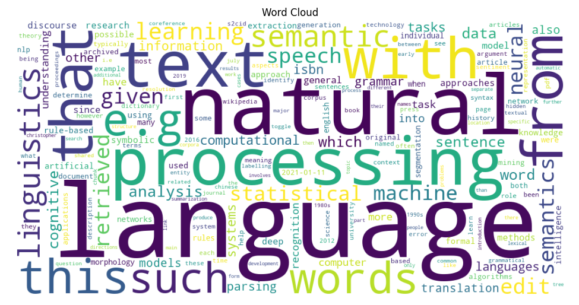

# nlp-01-getting-started
## Author: Lindsay Foster
## Date: March 2026

[](#)
[](./LICENSE)

> Professional Python project for Web Mining and Applied NLP.

Web Mining and Applied NLP focus on retrieving, processing, and analyzing text from the web and other digital sources.
This course builds those capabilities through working projects.

In the age of generative AI, durable skills are grounded in real work:
setting up a professional environment,
reading and running code,
understanding the logic,
and pushing work to a shared repository.
Each project follows a similar structure based on professional Python projects.
These projects are **hands-on textbooks** for learning Web Mining and Applied NLP.

## This Project

This is the **getting started** project.
The goal is to copy this repository, set up your environment, run the example script and notebook, and push your work to GitHub.
Then, you'll change the authorship to make the project yours and explore the structure.
No major code changes are required.

You'll work with just these areas:

- **notebooks/** - Jupyter notebooks for exploration
- **src/nlp/** - Python code (verifies .venv/)
- **pyproject.toml** - update authorship, links, and dependencies
- **zensical.toml** - update authorship and links

The goal is just to confirm you can run projects on your machine.
Once you get the first project running successfully,
the rest of the course is much easier.

## First: Follow These Instructions

Follow the [step-by-step workflow guide](https://denisecase.github.io/pro-analytics-02/workflow-b-apply-example-project/) to complete:

1. Phase 1. **Start & Run**
2. Phase 2. **Change Authorship**
3. Phase 3. **Read & Understand**

## Challenges

Challenges are expected.
Sometimes instructions may not quite match your operating system.
When issues occur, share screenshots, error messages, and details about what you tried.
Working through issues is an important part of implementing professional projects.

## Success

After completing Phase 1. **Start & Run**, you'll have your own GitHub project,
running on your machine, and running the example will print out:

```shell
========================
Pipeline executed successfully!
========================
```

And a new file named `project.log` will appear in the project folder.

Once you see it, you're 90% of the way there.
After that, you'll just make the project yours and get started exploring.

## Command Reference

The commands below are used in the workflow guide above.
They are provided here for convenience.

Follow the guide for the **full instructions**.

<details>
<summary>Show command reference</summary>

### In a machine terminal (open in your `Repos` folder)

After you get a copy of this repo in your own GitHub account,
open a machine terminal in your `Repos` folder:

```shell
git clone https://github.com/LFoster03/nlp-01-getting-started.git
cd nlp-01-getting-started
code .
```

### In a VS Code terminal

```shell
uv self update
uv python pin 3.14
uv sync --extra dev --extra docs --upgrade

uvx pre-commit install
git add -A
uvx pre-commit run --all-files

# Later, we install spacy data model and
# en_core_web_sm = english, core, web, small
# It's big: spacy+data ~200+ MB w/ model installed
#           ~350–450 MB for .venv is normal for NLP
# uv run python -m spacy download en_core_web_sm

# First, run the module
# IMPORTANT: Close each figure after viewing so execution continues
uv run python -m nlp.web_words_case

# Then, open the notebook.
# IMPORTANT: Select the kernel and Run All:
# notebooks/web_words_case.ipynb

uv run ruff format .
uv run ruff check . --fix
uv run zensical build

git add -A
git commit -m "update"
git push -u origin main
```

</details>

## Notes

- Use the **UP ARROW** and **DOWN ARROW** in the terminal to scroll through past commands.
- Use `CTRL+f` to find (and replace) text within a file.

## Example Artifact (Output)



## Modifications

- First, copy the folders notebooks and src.
- Then make modifications to give a better analysis.

### Stopword Filtering

- To improve the quality of the analysis, the script was modified to remove common English stopwords during the text-cleaning stage. Examples include words like this, that, with, from, and have. Removing these words helps ensure the analysis focuses on terms that better represent the actual content of the page.
  1. Add a Stopwords list before the text-cleaning logic of common English stopwords.
  2. Modify the cleaning logic to filter out stopwords.
- Observation: More of the technical words are shown instead of filler words.

### Additional Modification: Average Word Length

- An additional analytical metric was added to the script to calculate the average word length of the cleaned text. After the text cleaning stage, the script computes the average number of characters per word using the cleaned word list. Longer average word lengths can indicate more technical or specialized vocabulary, while shorter averages may indicate simpler language.
- Observation: Average word length is 7.54 characters meaning that there are longer words. This shows that the words may be more technical.

## Notebook Modifications
1. Average Word Length
- Calculated the average word length for all cleaned words in the text.
- Provides an additional metric for exploring text characteristics and vocabulary complexity.

2. Word Cloud Enhancement
- Generated a word cloud directly from word frequencies.
- Visualizes which words appear most often on the webpage.
- Allows quick insight into dominant topics and common terms.
